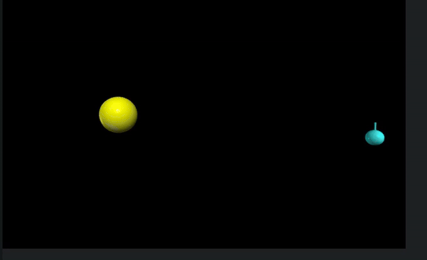

# 2 / 3-body-problem




### Inspiration:

Well, as you can clearly guess the idea behind this simulation come after the reading the first book of "The Three-Body Problem" Series which i completed a while back and started working on this after completing "The Dark Forest".

Anyway,

### Explaination:

You can check definition on Wikipedia.
Three bodies orbit each other, the resulting dynamical system is chaotic for most initial conditions. Because there are no solvable equations for most three-body systems, the only way to predict the motions of the bodies is to estimate them using numerical methods.

But heres simple explaination -
Imagine three kids on a trampoline. When one jumps, it bounces the others in different directions, and they all react to each other's movements. It can get pretty chaotic, and it’s tough to predict where they’ll land next. That’s similar to the three-body problem, where each body’s movement affects the others, making it complicated to figure out their paths!

I also created 2-body problem where I used Langragian Equation

### Key Concepts (What i also Learned):

1.**Conservation of Momentum**

2.**Lagrange’s Mechanics**

3.**Kinematics**

### How to Run the Simulation:

1. Ensure you have Python installed with the `vpython` library. You can install it using pip:

   ```bash
   pip install vpython

   ```

2. Clone this repo

3. Run python code

### Learning Resources:

[2 Body Problem](https://youtu.be/d05oyVJpv24?si=1_jkzCxI0kzRvUzM)
[3 Body Problem](https://youtu.be/YHHVkUrg4_M?si=Rda0CHQZV37WYsSl)

_...Great Youtube Channel to Learn Physics_

### More Great Resources

Here one i found great simulation of three body problem having special case
[Javalab](https://javalab.org/en/three_body_problem_en/)

[More Beautilful Special Cases](https://en.wikipedia.org/wiki/Three-body_problem#/media/File:5_4_800_36_downscaled.gif)

### Update

I just watch the new Netflix Series adapted on this same book series which is <span style="font-size: 24px; font-weight: bold;">Horrible !</span>
Ok ok , i say its okay. If you do wanna watch the series go for the _Chinese_ one which is very great.

I am still shocked how Netflix series completed into _1 hour_ each _8_ episode (yes yes its also comprises Book 2 and 3)
While Chinese one which i also watch has _30_ episode of just _Book 1_ , _1 hour_ each.

Me and my friend just argued about this as he loved Netflix one, while i argued giving the analogy like 'You are watching One Piece but while starting for main character Luffy and how he started his own adventure and start joining by other great characters. Here in Netflix one , all the characters had already joined and then the adventure has just started.
